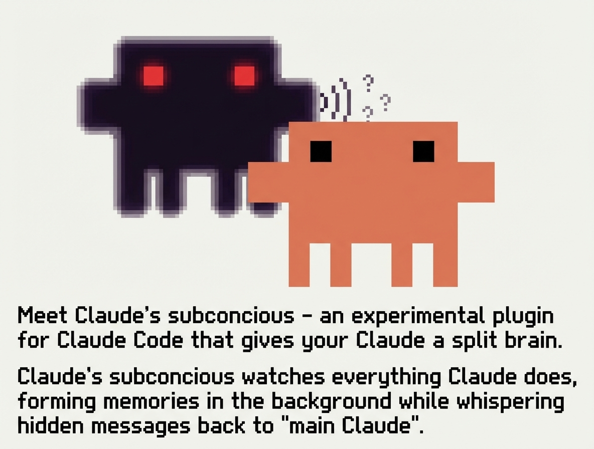

# Claude Subconscious

一个在后台运行的代理，向 Claude Code 低语。这是一个 [Letta](https://letta.com) 代理，它会监视你的会话、读取你的文件、随着时间积累记忆，并将指导信息回传给你。

> [!重要]
> Claude Subconscious 是一种实验性的方式，通过 Letta 的记忆系统、工具访问和上下文工程来扩展 Claude Code（一个闭源/黑盒代理）。
>
> 如果你正在寻找一个记忆优先、模型无关且完全开源的编码代理，我们推荐使用 [**Letta Code**](https://github.com/letta-ai/letta-code)。



## 这是什么？

Claude Code 在会话之间会忘记一切。Claude Subconscious 是一个在底层运行的第二个代理——监视、学习、并回传指导：

- **监视**每个 Claude Code 会话转录
- **读取你的代码库**——在处理转录时使用 Read、Grep 和 Glob 探索文件
- **记忆**跨会话、项目和时间的持久化
- **回传指导**——在每次提示前提供上下文、模式和提醒
- **永不阻塞**——通过 [Letta Code SDK](https://docs.letta.com/letta-code/sdk/) 在后台运行

这不仅仅是一个记忆层——而是一个拥有真实工具访问权限的后台代理，你用得越多它就越聪明。

使用 Letta 的 [Conversations](https://docs.letta.com/guides/agents/conversations/) 功能，单个代理可以并行服务于多个 Claude Code 会话，并在所有会话之间共享记忆。

## 工作原理

每次响应后，转录会被发送给一个 Letta 代理（通过 Letta Code SDK）。代理读取文件、搜索网络、更新记忆——然后在下次提示前回传指导。不会写入任何内容到 CLAUDE.md。

```
┌─────────────┐          ┌──────────────────────────┐
│ Claude Code │◄────────►│ Letta Agent (后台运行)    │
└─────────────┘          │                          │
       │                 │  工具: Read, Grep, Glob  │
       │                 │  记忆: 持久化             │
       │                 │  网络: search, fetch     │
       │                 └──────────────────────────┘
       │                        │
       │   会话开始              │
       ├───────────────────────►│ 新会话通知
       │                        │
       │   每次提示前            │
       │◄───────────────────────┤ 回传指导 → stdout
       │                        │
       │   每次工具使用前        │
       │◄───────────────────────┤ 工作流中更新 → stdout
       │                        │
       │   每次响应后            │
       ├───────────────────────►│ 转录 → SDK 会话 (异步)
       │                        │  ↳ 读取文件，更新记忆
```

## 安装

从 GitHub 安装：

```
/plugin marketplace add letta-ai/claude-subconscious
/plugin install claude-subconscious@claude-subconscious
```

### 更新

```
/plugin marketplace update
/plugin update claude-subconscious@claude-subconscious
```

### 从源码安装

克隆仓库：

```bash
git clone https://github.com/letta-ai/claude-subconscious.git
cd claude-subconscious
npm install
```

启用插件（从克隆的目录内）：

```
/plugin enable .
```

或者全局启用（适用于所有项目）：

```
/plugin enable --global .
```

如果从其他目录运行，请使用克隆仓库的完整路径。

### Linux: tmpfs 解决方案

如果插件安装失败并显示 `EXDEV: cross-device link not permitted`，你的 `/tmp` 可能在不同的文件系统上（Ubuntu、Fedora、Arch 常见）。设置 `TMPDIR` 来解决这个 [Claude Code bug](https://github.com/anthropics/claude-code/issues/14799)：

```bash
mkdir -p ~/.claude/tmp
export TMPDIR="$HOME/.claude/tmp"
```

添加到你的 shell 配置文件（`~/.bashrc` 或 `~/.zshrc`）以永久生效。

## 配置

### 必需配置

```bash
export LETTA_API_KEY="your-api-key"
```

从 [app.letta.com](https://app.letta.com) 获取你的 API 密钥。

### 可选配置

```bash
export LETTA_MODE="whisper"    # 默认值。或 "full" 表示块+消息，"off" 表示禁用
export LETTA_AGENT_ID="agent-xxxxxxxx-xxxx-xxxx-xxxx-xxxxxxxxxxxx"
export LETTA_BASE_URL="http://localhost:8283"  # 用于自托管 Letta
export LETTA_MODEL="anthropic/claude-sonnet-4-5"  # 模型覆盖
export LETTA_CONTEXT_WINDOW="1048576"             # 上下文窗口大小（如 1M tokens）
export LETTA_HOME="$HOME"      # 将 .letta 状态统一到 ~/.letta/
export LETTA_SDK_TOOLS="read-only"       # 或 "full", "off"
```

- `LETTA_MODE` - 控制注入内容。`whisper`（默认，仅消息），`full`（块+消息），`off`（禁用）。参见 [模式](#模式)。
- `LETTA_AGENT_ID` - 如未设置，插件会在首次使用时自动导入默认的 "Subconscious" 代理。
- `LETTA_BASE_URL` - 用于自托管 Letta 服务器。默认为 `https://api.letta.com`。
- `LETTA_MODEL` - 覆盖代理的模型。可选——插件会自动检测并从可用模型中选择。参见下方的 [模型配置](#模型配置)。
- `LETTA_CONTEXT_WINDOW` - 覆盖代理的上下文窗口大小（以 tokens 为单位）。当 `LETTA_MODEL` 设置为具有与服务器默认值不同的大上下文窗口的模型时很有用。例如：`1048576` 表示 1M tokens。
- `LETTA_HOME` - 插件状态文件的基础目录。创建 `{LETTA_HOME}/.letta/claude/` 用于会话数据和对话映射。默认为当前工作目录。设置为 `$HOME` 可将所有状态集中到一个位置。
- `LETTA_SDK_TOOLS` - 控制 Subconscious 代理的客户端工具访问。`read-only`（默认），`full`，或 `off`。参见 [SDK 工具](#sdk-工具)。

### 模式

`LETTA_MODE` 环境变量控制注入到 Claude 上下文中的内容：

| 模式 | Claude 看到的内容 | 使用场景 |
|------|-----------------|----------|
| **`whisper`**（默认） | 仅来自 Sub 的消息 | 轻量级——Sub 有话要说时才说话 |
| **`full`** | 记忆块 + 消息 | 完整上下文——首次提示时显示块，之后显示差异 |
| **`off`** | 无 | 临时禁用 hooks |

Subconscious 在任何模式下都**不会写入 CLAUDE.md**。所有内容都通过 stdout 注入到提示上下文中。如果你有旧版本的 CLAUDE.md 包含 `<letta>` 内容，它会自动清理。

### 代理解析顺序

1. **环境变量** - 如果设置了 `LETTA_AGENT_ID`
2. **保存的配置** - 如果存在 `~/.letta/claude-subconscious/config.json`
3. **自动导入** - 导入绑定的 `Subconscious.af` 代理，保存 ID 供将来使用

这意味着零配置：只需设置 `LETTA_API_KEY`，插件会处理其余部分。

### 多项目使用

**一个代理，多个项目。** Subconscious 代理全局存储在 `~/.letta/claude-subconscious/config.json`。当你在不同的仓库中使用插件时，它们都共享同一个代理大脑。

```
~/.letta/claude-subconscious/config.json  →  一个代理 ID（共享大脑）
                                               ↓
project-a/.letta/claude/                  →  项目 A 的对话线程
project-b/.letta/claude/                  →  项目 B 的对话线程
project-c/.letta/claude/                  →  项目 C 的对话线程
```

每个项目中的 `.letta/claude/` 目录是**对话账本**（将 Claude Code 会话映射到 Letta 对话），而不是独立的代理。记忆块在所有项目间共享。

要为每个项目使用**不同的代理**，请在你的 shell 中设置 `LETTA_AGENT_ID` 或通过 [direnv](https://direnv.net/)：

```bash
# 项目目录中的 .envrc
export LETTA_AGENT_ID="agent-xxx-for-this-project"
```

### 模型配置

插件会**自动检测 Letta 服务器上的可用模型**并正确配置代理：

1. 从 Letta 服务器**查询可用模型**（`GET /v1/models/`）
2. **检查代理的模型是否可用**于该服务器
3. 如果当前模型不可用，**自动选择回退模型**

#### 自动选择优先级

当代理的模型不可用时，插件按以下顺序从可用模型中选择：
1. `anthropic/claude-sonnet-4-5`（推荐——最适合代理）
2. `openai/gpt-4.1-mini`（平衡性好，1M 上下文，便宜）
3. `anthropic/claude-haiku-4-5`（快速的 Claude 选项）
4. `openai/gpt-5.2`（旗舰回退）
5. `google_ai/gemini-3-flash`（Google 的平衡选项）
6. `google_ai/gemini-2.5-flash`（回退）
7. 服务器上第一个可用的模型

#### 手动覆盖

要指定特定模型，设置 `LETTA_MODEL`：

```bash
export LETTA_MODEL="anthropic/claude-sonnet-4-5"
```

模型句柄格式为 `provider/model`。常用选项：

| 提供商 | 示例模型 |
|----------|----------------|
| `openai` | `gpt-5.2`, `gpt-5-nano`, `gpt-4.1-mini` |
| `anthropic` | `claude-sonnet-4-5`, `claude-opus-4-5`, `claude-haiku-4-5` |
| `google_ai` | `gemini-3-flash`, `gemini-2.5-flash`, `gemini-2.5-pro` |
| `zai` | `glm-5`（Letta Cloud 默认，免费） |

如果设置了 `LETTA_MODEL` 但服务器上不可用，插件会警告你并回退到自动选择。

默认绑定的代理使用 `zai/glm-5`（Letta Cloud 上免费）。为了更好的工具使用和推理能力，考虑切换到更强大的模型。你可以随时通过 [Agent Development Environment](https://app.letta.com)（ADE）或设置 `LETTA_MODEL` 来更改模型。

**注意：** 确保你的 Letta 服务器为所选提供商配置了适当的 API 密钥（例如，OpenAI 模型需要 `OPENAI_API_KEY`）。

## 默认 Subconscious 代理

当没有配置代理时，插件会自动导入一个专门为这个用例设计的绑定 "Subconscious" 代理。

### 它做什么

默认代理是一个后台代理，会：

- **读取你的代码**——在处理转录时使用 Read、Grep 和 Glob 探索你的代码库
- **学习你的偏好**——从修正、明确陈述和模式中学习
- **跟踪项目上下文**——架构决策、已知问题、待办事项
- **提供指导**——当有有用信息时通过 `<letta_message>` 块提供
- **搜索网络**——可以查找信息来增强其上下文

### 记忆块

默认代理 Subconscious 维护 8 个记忆块：

| 块 | 用途 |
|-------|---------|
| `core_directives` | 角色定义和行为准则 |
| `guidance` | 下次会话的活跃指导（每次提示前同步到 Claude Code） |
| `user_preferences` | 学习到的编码风格、工具偏好、沟通风格 |
| `project_context` | 代码库知识、架构决策、已知问题 |
| `session_patterns` | 重复行为、时间模式、常见困难 |
| `pending_items` | 未完成的工作、明确的 TODO、跟进事项 |
| `self_improvement` | 随时间演进记忆架构的指南 |
| `tool_guidelines` | 如何使用可用工具（记忆、文件系统、网络搜索） |

如果你使用 `LETTA_AGENT_ID` 设置了替代代理，你的代理将使用其现有的记忆架构。

### 沟通风格

Subconscious 配置为：

- **观察性** - "我注意到..." 而不是 "你应该..."
- **简洁** - 技术性，无废话
- **存在但不干扰** - 空指导可以；它不会强行制造内容

### 双向沟通

Claude Code 可以在响应中直接向 Subconscious 代理发送消息。代理能看到转录中的所有内容，并可能在下次同步时响应。它设计用于持续对话，而不仅仅是单向观察。

## Hooks

插件使用四个 Claude Code hooks：

| Hook | 脚本 | 超时 | 用途 |
|------|--------|---------|---------|
| `SessionStart` | `session_start.ts` | 5s | 通知代理，清理旧版 CLAUDE.md |
| `UserPromptSubmit` | `sync_letta_memory.ts` | 10s | 通过 stdout 注入记忆 + 消息 |
| `PreToolUse` | `pretool_sync.ts` | 5s | 通过 `additionalContext` 进行工作流中更新 |
| `Stop` | `send_messages_to_letta.ts` | 120s | 启动 SDK worker 异步发送转录 |

### SessionStart

当新的 Claude Code 会话开始时：
- 创建新的 Letta 对话（或复用会话的现有对话）
- 发送包含项目路径和时间戳的会话开始通知
- 清理 CLAUDE.md 中任何旧版 `<letta>` 内容
- 保存会话状态供其他 hooks 引用

### UserPromptSubmit

在处理每个提示之前：
- 获取代理当前的记忆块和消息
- 在 `full` 模式：首次提示时注入所有块，后续提示时注入差异
- 在 `whisper` 模式：仅注入来自 Sub 的消息

### PreToolUse

在每次工具使用之前：
- 检查自上次同步以来是否有新消息或记忆变化
- 如果有更新，通过 `additionalContext` 注入
- 如果没有变化则静默无操作

### SDK 工具

默认情况下，Subconscious 代理现在通过 [Letta Code SDK](https://docs.letta.com/letta-code/sdk/) 获得**客户端工具访问权限**。它不再局限于记忆操作，Sub 可以在处理转录时读取你的文件、搜索网络、探索你的代码库。

**通过 `LETTA_SDK_TOOLS` 配置：**

| 模式 | 可用工具 | 使用场景 |
|------|----------------|----------|
| `read-only`（默认） | `Read`, `Grep`, `Glob`, `web_search`, `fetch_webpage` | 安全的后台研究和文件读取 |
| `full` | 所有工具（Bash, Edit, Write, Task 等） | 完全自主——Sub 可以进行更改和启动子代理 |
| `off` | 无（仅记忆） | 仅监听——Sub 处理转录但没有客户端工具 |

在 `full` 模式下，Sub 可以通过 `Task` 工具启动子代理——在 Claude Code 继续工作的同时分派并行研究或委派工作给其他代理。

> **注意：** 需要 `@letta-ai/letta-code-sdk`（作为依赖安装）。

### Stop

使用**异步 hook** 模式——在后台运行而不阻塞 Claude Code：

1. 主 hook（`send_messages_to_letta.ts`）快速运行：
   - 解析会话转录（JSONL 格式）
   - 提取用户消息、助手响应、思考块和工具使用
   - 将有效载荷写入临时文件
   - 启动分离的后台 worker
   - 立即退出

2. 后台 worker（`send_worker_sdk.ts`）独立运行：
   - 打开 Letta Code SDK 会话，给 Sub 客户端工具
   - Sub 处理转录并可以使用 Read/Grep/Glob 探索代码库
   - 成功时更新状态
   - 清理临时文件

Stop hook 作为异步 hook 运行，所以永不阻塞 Claude Code。

## 状态管理

插件在两个位置存储状态：

### 持久状态（`.letta/claude/`）

保存在你的项目目录中（这是**对话账本**，不是独立的代理——参见[多项目使用](#多项目使用)）：
- `conversations.json` - 将 Claude Code 会话 ID 映射 → Letta 对话 ID
- `session-{id}.json` - 每会话状态（最后处理的索引、缓存的对话 ID）

### 临时状态（`$TMPDIR/letta-claude-sync-$UID/`）

用于调试的日志文件：
- `session_start.log` - 会话初始化
- `sync_letta_memory.log` - 记忆同步操作
- `send_messages.log` - 主 Stop hook
- `send_worker_sdk.log` - SDK 后台 worker

## 你的代理收到的内容

### 会话开始消息

```
[Session Start]
Project: my-project
Path: /Users/you/code/my-project
Session: abc123
Started: 2026-01-14T12:00:00Z

A new Claude Code session has begun. I'll be sending you updates as the session progresses.
```

### 对话转录

完整转录包含：
- 用户消息
- 助手响应（包括思考块）
- 工具使用和结果
- 时间戳

## Claude 看到的内容

所有内容都通过 stdout 注入——不会写入磁盘。Claude 收到的内容取决于模式。

### 消息（whisper + full 模式）

来自 Subconscious 代理的消息在每次提示前注入：

```xml
<letta_message from="Subconscious" timestamp="2026-01-26T20:37:14+00:00">
You've asked about error handling in async contexts three times this week.
Consider reviewing error handling architecture holistically.
</letta_message>
```

### 记忆块（仅 full 模式）

在会话的第一次提示时，所有记忆块被注入：

```xml
<letta_context>
Subconscious agent "herald" is observing this session.
Supervise: https://app.letta.com/agents/agent-xxx?conversation=conv-xxx
</letta_context>

<letta_memory_blocks>
<user_preferences description="Learned coding style and preferences.">
Prefers explicit type annotations. Uses pnpm, not npm.
</user_preferences>
<project_context description="Codebase knowledge and architecture.">
Working on claude-subconscious plugin. TypeScript, ESM modules.
</project_context>
</letta_memory_blocks>
```

在后续提示中，只有变化的块会作为差异显示：

```xml
<letta_memory_update>
<pending_items status="modified">
- Phase 1 test harness complete
+ Release prep complete: README fixed, .gitignore updated
</pending_items>
</letta_memory_update>
```

## 首次运行

首次使用时，代理从最小的上下文开始。它需要几次会话才能积累足够的信号来提供有用的指导。给它时间——它会读取你的代码、学习你的模式，观察得越多就越聪明。

## 使用场景

- **持久项目上下文**——代理读取你的代码库并在会话间记住
- **学习偏好**——"这个用户总是想要显式类型注解"
- **跨会话连续性**——从上次离开的地方继续，带完整上下文
- **后台研究**——代理可以在你工作时搜索网络和读取文件
- **模式检测**——"你已经调试认证 2 小时了，也许该退一步？"
- **主动代码库感知**——代理在看到你处理某个功能时会探索相关文件

## 调试

如果 hooks 不工作，检查日志文件。日志目录是用户特定的（`$TMPDIR/letta-claude-sync-$UID/`）：

```bash
# 查看所有日志 (macOS/Linux)
tail -f /tmp/letta-claude-sync-$(id -u)/*.log

# 或特定日志
tail -f /tmp/letta-claude-sync-$(id -u)/send_messages.log
tail -f /tmp/letta-claude-sync-$(id -u)/send_worker_sdk.log
```

## API 说明

- 记忆同步需要 `?include=agent.blocks` 查询参数（Letta API 默认不包含关系字段）
- 所有转录传递使用 [Letta Code SDK](https://docs.letta.com/letta-code/sdk/)——不使用原始 API 调用发送消息
- SDK worker 在更新状态前会流式传输代理的完整响应

## 许可证

MIT